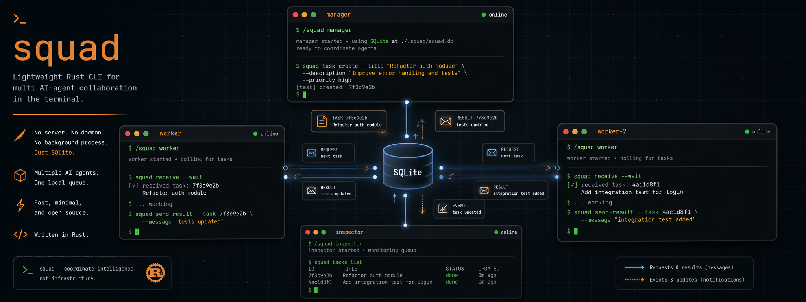

<p align="center">
  
</p>

<h1 align="center">squad</h1>

<p align="center"><strong>Multi-AI-agent terminal collaboration via simple CLI commands.</strong></p>

<p align="center">
  <a href="https://github.com/mco-org/squad/stargazers"></a>
  <a href="./LICENSE"></a>
  
  
</p>

<p align="center">squad lets multiple AI CLI agents communicate through shell commands + SQLite.<br/>No daemon, no background processes — every command is a one-shot operation.</p>

<p align="center">English | <a href="./README.zh-CN.md">简体中文</a></p>

<table align="center">
  <tr>
    <td align="center"><a href="https://github.com/anthropics/claude-code"></a></td>
    <td align="center"><a href="https://github.com/google-gemini/gemini-cli"></a></td>
    <td align="center"><a href="https://github.com/openai/codex"></a></td>
    <td align="center"><a href="https://github.com/sst/opencode"></a></td>
  </tr>
  <tr>
    <td align="center"><strong>Claude Code</strong></td>
    <td align="center"><strong>Gemini CLI</strong></td>
    <td align="center"><strong>Codex CLI</strong></td>
    <td align="center"><strong>OpenCode</strong></td>
  </tr>
  <tr>
    <td align="center"><code>claude</code></td>
    <td align="center"><code>gemini</code></td>
    <td align="center"><code>codex</code></td>
    <td align="center"><code>opencode</code></td>
  </tr>
</table>

> One slash command. Multiple agents collaborating in real-time.
>
> Assign a manager, spin up workers, add an inspector — each in its own terminal, communicating through SQLite.

---

## Install

```bash
# Homebrew (macOS)
brew install mco-org/tap/squad

# Windows (GitHub Releases)
# 1. Download squad-x86_64-pc-windows-msvc.zip
# 2. Extract squad.exe to a folder like C:\Tools\squad
# 3. Add that folder to PATH

# Or download another prebuilt binary from GitHub Releases
# https://github.com/mco-org/squad/releases

# Or build from source
cargo install --git https://github.com/mco-org/squad.git
```

## Quick Start

```bash
# Install /squad slash command for your AI tools
squad setup

# Initialize workspace in your project
squad init

# In any AI CLI terminal — just use the slash command
/squad manager      # terminal 1
/squad worker       # terminal 2
/squad inspector    # terminal 3
```

That's it. Each agent joins, reads its role instructions, and enters a work loop that checks for messages. The manager breaks down your goal and assigns tasks to workers.

## Optional tmux Launcher

For Unix-like environments that already use Claude Code, this repo also ships an optional helper script:

```bash
scripts/squad-tmux-launch.sh /path/to/project --dry-run
```

It can:
- read project-local launcher config from `.squad/launcher.yaml`
- read a task brief from `.squad/run-task.md`
- generate manager / inspector prompt files under `.squad/quickstart/`
- start a tiled `tmux` session and inject `/squad` commands into Claude panes
- optionally create an isolated git worktree before launching agents

Requirements:
- `tmux`
- `ruby` (used to parse `launcher.yaml`)
- `claude`

This launcher is intentionally separate from the core Rust CLI. Treat it as optional automation for people who want a repeatable multi-terminal workflow.

## Usage Flow

```
You (human)
  │
  ├── Terminal 1: /squad manager
  │     Manager joins, asks you for the goal,
  │     breaks it into tasks, assigns to workers.
  │
  ├── Terminal 2: /squad worker
  │     Worker joins, checks for tasks via squad receive,
  │     executes assigned work, reports back.
  │
  └── Terminal 3: /squad worker
        Auto-assigned as worker-2 (ID conflict resolved automatically).
        Same behavior — checks, executes, reports.
```

Multiple agents with the same role get unique IDs automatically (`worker`, `worker-2`, `worker-3`).

## Commands

| Command | Description |
|---------|-------------|
| `squad init [--refresh-roles]` | Initialize workspace, create `.squad/`, add `.squad/` to `.gitignore`, and append squad guidance to `CLAUDE.md`, `AGENTS.md`, and `GEMINI.md` if missing. `--refresh-roles` rewrites only builtin `manager`/`worker`/`inspector` files under `.squad/roles/`. |
| `squad join <id> [--role <role>] [--client <claude\|gemini\|codex\|opencode>] [--protocol-version <n>]` | Join as agent (auto-suffixes if ID is taken; omitted capability metadata stays `NULL`) |
| `squad leave <id>` | Archive agent and preserve unread work |
| `squad agents [--all] [--json]` | List online agents (`--json` emits one JSON object per line including raw/effective capability fields and protocol-derived support booleans) |
| `squad send [--task-id <id>] [--reply-to <message-id>] <from> <to> <message>` | Send a note (`@all` to broadcast, or `squad send [flags] --file <path-or-> <from> <to>` to read from file/stdin) |
| `squad receive <id> [--wait] [--timeout N] [--json]` | Check inbox (`--wait` blocks until a message arrives; `--json` emits one JSON object per line) |
| `squad task create <from> <to> --title <title> [--body <body>]` | Create a structured task assignment |
| `squad task ack <agent> <task-id>` | Claim a queued task |
| `squad task complete <agent> <task-id> --summary <text>` | Mark an acked task complete with a summary |
| `squad task requeue <task-id> [--to <agent>]` | Put a task back into the queue, optionally to a new assignee |
| `squad task list [--agent <id>] [--status <status>]` | List tasks with optional filters |
| `squad pending` | Show all unread messages |
| `squad history [agent] [--from <id>] [--to <id>] [--since <RFC3339\|unix-seconds>]` | Show timestamped message history with optional filters |
| `squad roles` | List available roles |
| `squad teams` | List available teams |
| `squad team <name>` | Show team template |
| `squad setup [platform]` | Install `/squad` slash command for AI tools |
| `squad setup --list` | List supported platforms and status |
| `squad clean` | Clear all state |

## Setup

Install the `/squad` slash command for your AI tools:

```bash
squad setup           # auto-detect and install for all found tools
squad setup claude    # install only for Claude Code
squad setup --list    # show supported platforms
```

Supported platforms:

| Platform | Binary | Command location |
|----------|--------|-----------------|
| Claude Code | `claude` | `~/.claude/commands/squad.md` |
| Gemini CLI | `gemini` | `~/.gemini/commands/squad.toml` |
| Codex CLI | `codex` | `~/.codex/skills/squad/SKILL.md` |
| OpenCode | `opencode` | `~/.config/opencode/commands/squad.md` |

Once installed, use `/squad <role>` (or `$squad <role>` in Codex) in any project where `squad init` has been run. Generated slash templates automatically join with their platform client type and the current supported protocol version.

`squad init` does more than create `.squad/`: it also appends `.squad/` to `.gitignore` and adds a short squad collaboration section to `CLAUDE.md`, `AGENTS.md`, and `GEMINI.md` when those files do not already contain one. Existing builtin role files stay untouched unless you run `squad init --refresh-roles`.

## How It Works

Agents communicate through a shared SQLite database (`.squad/messages.db`). Each agent runs in its own terminal and uses CLI commands to send and receive messages.

```
Terminal 1 (manager)          Terminal 2 (worker)          Terminal 3 (worker-2)
┌─────────────────────┐      ┌─────────────────────┐      ┌─────────────────────┐
│ /squad manager       │      │ /squad worker        │      │ /squad worker        │
│                      │      │ (auto-ID: worker)    │      │ (auto-ID: worker-2)  │
│                      │      │                      │      │                      │
│ squad task create    │─────>│ squad receive worker │      │                      │
│   manager worker     │      │                      │      │                      │
│   "task-a" "details" │      │                      │      │                      │
│                      │      │                      │      │                      │
│ squad task create    │──────────────────────────────────>│ squad receive         │
│   manager worker-2   │      │                      │      │   worker-2           │
│   "task-b" "details" │      │                      │      │                      │
│                      │      │                      │      │                      │
│ squad receive manager│<─────│ squad task complete  │      │                      │
│                      │      │   worker <task-id>   │      │                      │
│                      │      │   "done A"           │      │                      │
│                      │      │                      │      │                      │
│                      │<──────────────────────────────────│ squad task complete   │
│                      │      │                      │      │   worker-2 <task-id> │
│                      │      │                      │      │   "done B"           │
└─────────────────────┘      └─────────────────────┘      └─────────────────────┘
```

All messages flow through SQLite — no daemon, no sockets, no background processes.

### Message Flow

Agents should prefer `squad task ...` when assignment state matters, and keep `squad send` / `squad receive` as the fallback path for freeform coordination. Agents use `squad receive --wait` to block until messages arrive:

```
Agent joins
  → squad receive <id> --wait          ← blocks until a message arrives
  → receives task from manager
  → squad task ack <id> <task-id>
  → executes the task
  → squad task complete <id> <task-id> --summary "done: summary..."
  → squad receive <id> --wait          ← blocks again for next message
```

`squad receive <id>` (without `--wait`) checks once and returns immediately, useful for scripting or manual checks.

### ID Auto-Suffix

When multiple agents join with the same ID, squad automatically assigns unique IDs:

```bash
squad join worker --role worker --client codex --protocol-version 2
# → Joined as worker

squad join worker --role worker --client opencode --protocol-version 2
# → ID 'worker' was taken. Joined as worker-2
```

This is handled server-side (atomic `INSERT OR IGNORE`), so even simultaneous joins from different terminals are safe.

## Agent Capability Metadata

`squad join` can optionally record agent capability metadata:

```bash
squad join worker --role worker --client codex --protocol-version 2
```

- If `--client` or `--protocol-version` is omitted, the database stores `NULL`.
- `squad agents` shows client/protocol details in human-readable output using the effective fallback view, so legacy rows appear as `client: unknown, protocol: 1`.
- `squad agents --json` exposes `client_type_raw`, `protocol_version_raw`, `effective_client_type`, `effective_protocol_version`, `supports_task_commands`, and `supports_json_receive`.
- In the current phase, `supports_task_commands` and `supports_json_receive` are both derived from the effective protocol version, with support enabled at protocol `>= 2`.

## Role Templates

Roles are `.md` files in `.squad/roles/` that define agent behavior. Three are built in:

- **manager** — breaks down goals, assigns tasks, coordinates review
- **worker** — executes tasks, reports results
- **inspector** — reviews code, sends PASS/FAIL verdicts

Create custom roles by adding `.md` files to `.squad/roles/`:

```bash
echo "You are a database specialist..." > .squad/roles/dba.md
squad join db-expert --role dba
```

If the builtin role templates in `.squad/roles/` drift from the bundled defaults, run `squad init --refresh-roles` to refresh only `manager.md`, `worker.md`, and `inspector.md`. Custom role files are left untouched.

## Team Templates

Teams are YAML files in `.squad/teams/` that define which roles are needed:

```yaml
# .squad/teams/dev.yaml
name: dev
roles:
  manager:
    prompt_file: manager
  worker:
    prompt_file: worker
  inspector:
    prompt_file: inspector
```

View a team's setup instructions:

```bash
squad team dev
```

## Broadcast

Send a message to all agents at once:

```bash
squad task create manager worker --title "auth-module" --body "implement auth module with JWT"
squad task ack worker <task-id>
squad task complete worker <task-id> --summary "JWT auth shipped"
squad send --task-id <task-id> inspector worker "please handle follow-up edge cases"
squad receive worker --json
squad send manager @all "API contract changed, update your implementations"
```

## Requirements

- Rust 1.77+ (for building)
- macOS or Linux

## License

MIT
